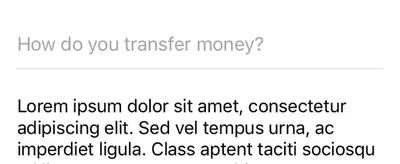

Yet another ["float label pattern"](http://mds.is/float-label-pattern/) component written in Swift with attention to the smallest details. It is very customizable. By providing your own colors and geometry you can make it look exactly like you want it to be. More, it's possible to display assistive text (user input error or helper text) same way as described in [material design](https://material.io/design/components/text-fields.html#anatomy).

Less words, GIF:

</img>

Of course you can see it in action in our [iOS application](https://itunes.apple.com/gb/app/transferwise-money-transfer/id612261027).